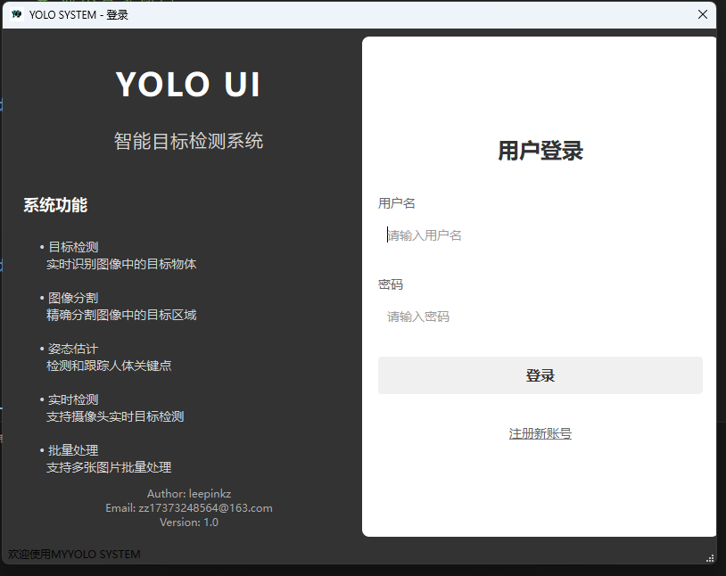
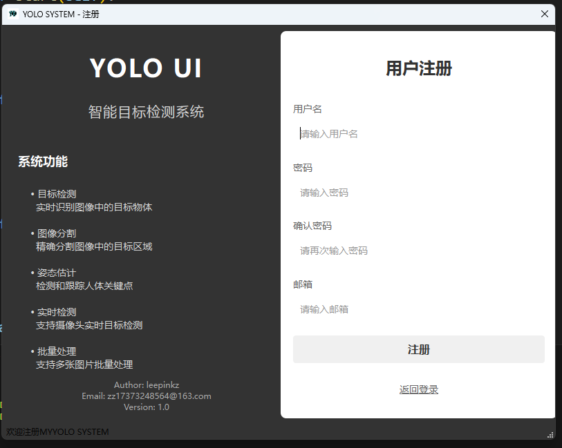
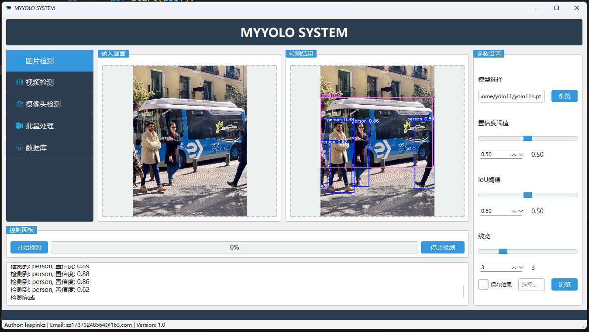
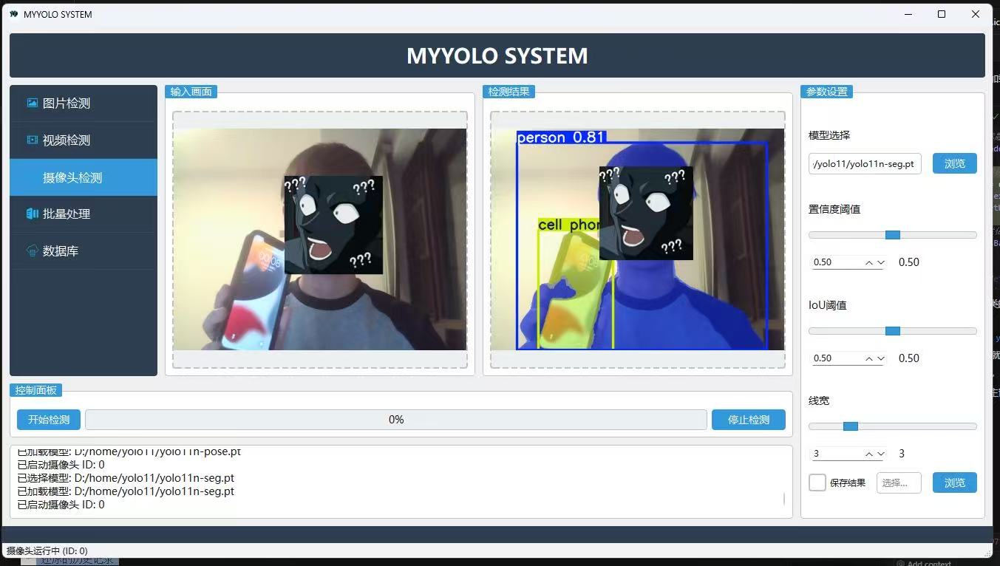
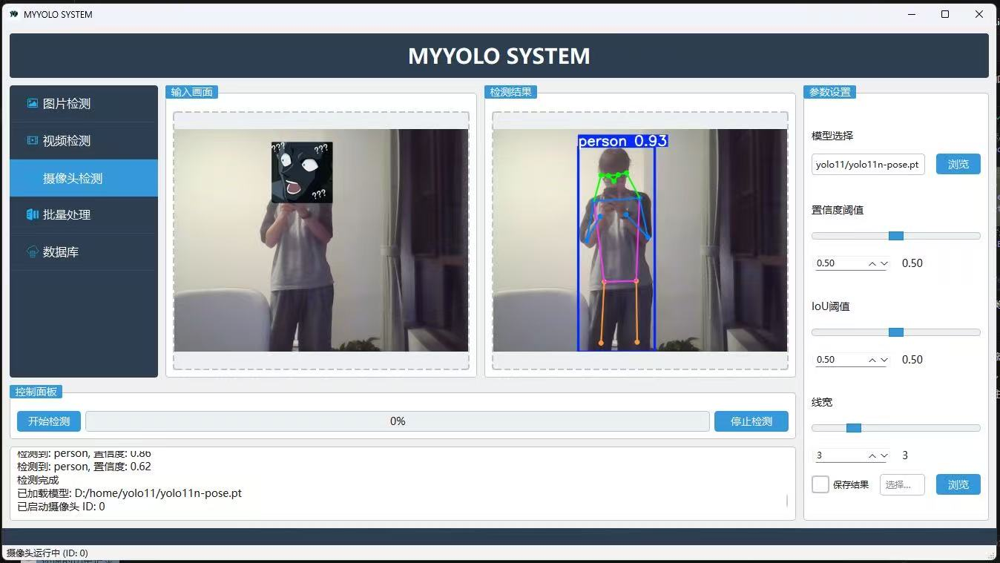
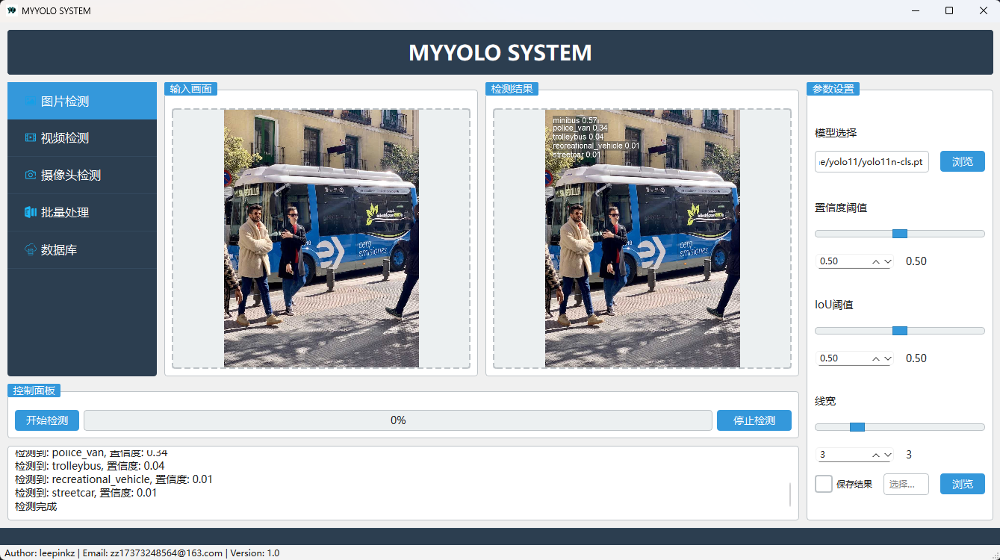

# YOLO Object Detection System

A graphical interface object detection system based on YOLO11, supporting multiple detection tasks including object detection, instance segmentation, pose estimation, and image classification.

## Features

- Support for multiple YOLO tasks: object detection, instance segmentation, pose estimation, image classification
- User-friendly graphical interface
- Support for image, video, and real-time camera detection
- User login and registration system
- Detection results saving functionality

## Installation

1. Clone the repository:
```bash
git clone [your repository URL]
```

2. Install dependencies:
```bash
pip install -r requirements.txt
```

3. Download pre-trained models:
- The project includes the following pre-trained model files:
  - yolo11n.pt (object detection)
  - yolo11n-seg.pt (instance segmentation)
  - yolo11n-pose.pt (pose estimation)
  - yolo11n-cls.pt (image classification)

## Usage

1. Run the program:
```bash
python main.py
```

2. Login to the system:
   - Register an account for first-time use
   - Login with your registered credentials

3. Main interface operations:
   - Select detection task type
   - Choose input source (image/video/camera)
   - Adjust confidence threshold
   - Start detection
   - View and save results

## Project Structure

```
├── main.py              # Program entry
├── main_window.py       # Main window interface
├── login.py            # Login interface
├── register.py         # Registration interface
├── user_manager.py     # User management
├── yolo_detector.py    # YOLO detection core
├── ui/                 # UI files directory
├── icons/             # Icon resources
├── results/           # Detection results directory
└── ultralytics/       # YOLO model related
```

## Feature Showcase

### User Interface
#### Login Interface


#### Registration Interface


### Detection Features
#### Object Detection


#### Instance Segmentation


#### Pose Estimation


#### Image Classification


## Notes

- Ensure Python 3.8 or higher is installed
- Models may need to be downloaded on first run
- GPU is recommended for better performance

## License

This project is licensed under the MIT License. See the [LICENSE](LICENSE) file for details. 
